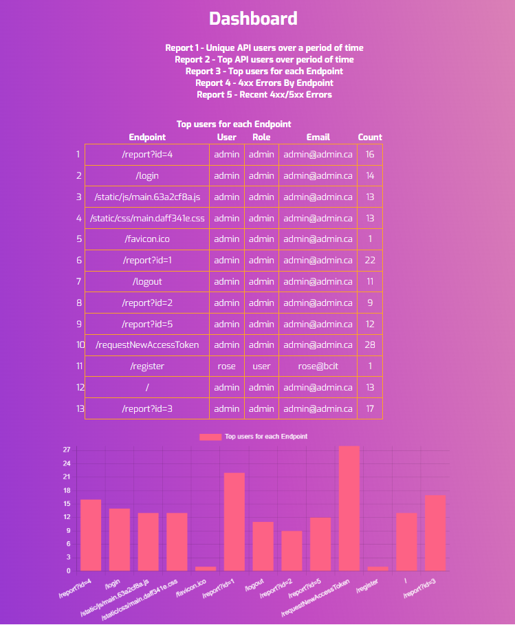
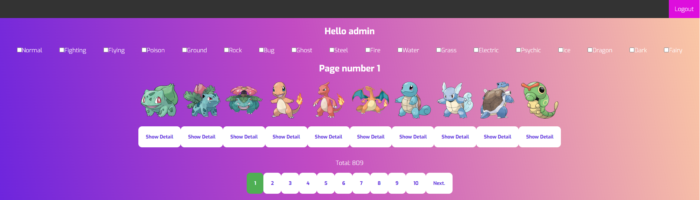
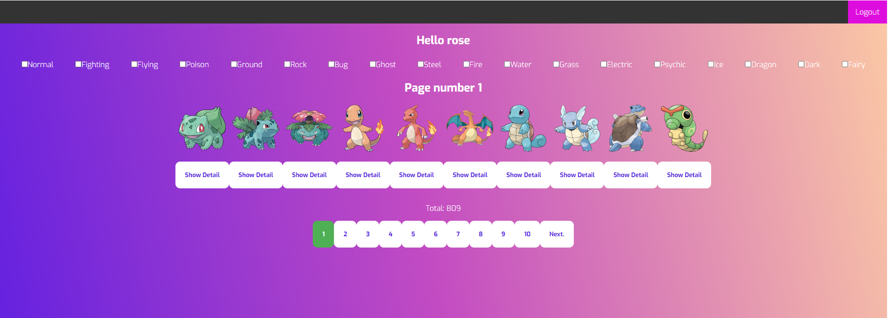
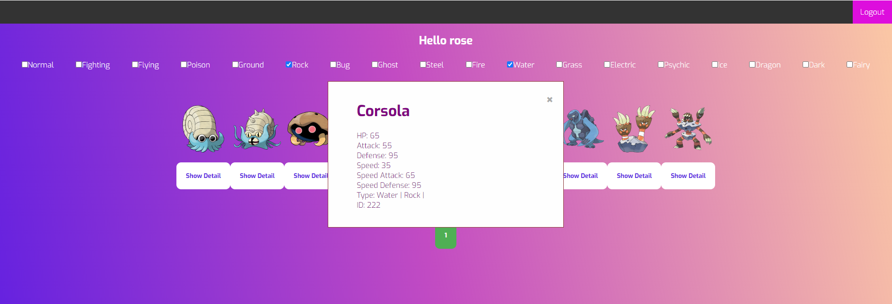

# Pokedex - Where you can find all the information about your favorite pokemons

This is a project where I utilized MERN stack to create a Pokedex. The application is deployed on AWS EC2 instance and can be accessed at http://ec2-52-91-210-207.compute-1.amazonaws.com:5000/

## To try the app, please use the credentials below:
For Admin user:
```username: admin```
```password: admin```

For Regular user:
```username: rose```
```password: 12345```

## Demo Photos:

Admin Dashboard


Admin Pokedex


Regular User Pokedex


Filtered Pokemons and Details

